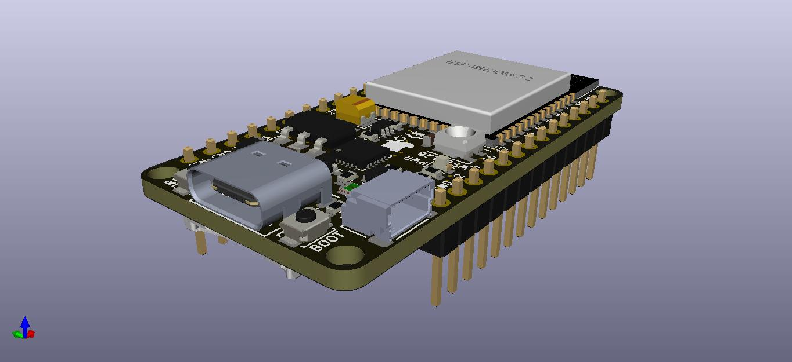

<p align="center">
  
</p>

<h1 align="center">SirBoard</h1>

<p align="center">
  <b>Open hardware for people who would rather prototype than reflow.</b><br>
  107 PCB designs — breakout adapters, development boards and a 39-part sensor line.<br>
  Routed in KiCad. Black soldermask, ENIG gold, 0.1&Prime; pitch.
</p>

<p align="center">
  <a href="https://vulos.org/projects/sirboard"><b>vulos.org/projects/sirboard</b></a>
  ·
  <a href="docs/OVERVIEW.md">Docs</a>
  ·
  <a href="LICENSE-MIT">MIT OR Apache-2.0</a>
</p>

<p align="center">
  
  
</p>

---

Most interesting silicon ships in a package that will not sit on a breadboard.
SirBoard answers that in three layers: **bare adapters** you solder the part
onto yourself, **modules** with the part already placed and supported, and
**development boards** with a microcontroller, regulator, USB and headers.

## What's here

| Directory | Contents |
|---|---|
| [`Breakout/`](Breakout) | **21 adapters** — QFN, TQFP, SOIC, SOT, USB, MicroSD, coin cells, ESP module carriers |
| [`Boards/`](Boards) | **9 families** — ATTiny, ATMega328PB/32U4/1284P, ESP32/ESP8266, USB-UART, level shifting, port expansion, a programmer |
| [`Sensors/`](Sensors) | **SirBlue** — 39 digital sensors on one 4-pin JST-SH connector, plus two earlier collections |
| [`Modules/`](Modules) | EEPROM, FRAM, real-time clocks |
| [`Fritzing/`](Fritzing) | 60 hand-drawn breadboard SVGs |

## Quick start

```bash
git clone git@github.com:vul-os/sirboard.git
cd sirboard

# every design ships a plotted PDF and renders — no tools needed to read one
open Boards/SirTiny/ATTinyX16/ATTinyX16.pdf

# or open the project itself
kicad Boards/SirTiny/ATTinyX16/ATTinyX16.pro
```

These are **KiCad 5** files (board format `20171130`). KiCad 6 through 9 open
them and offer to convert on save.

## The sensor line

Every [SirBlue](Sensors/SirBlue) board carries the same 4-pin 1.00 mm JST-SH
connector — `GND · VCC · SDA · SCL` — and the same outline. One cable fits all
39 parts, so swapping an accelerometer for a time-of-flight ranger is a
connector move rather than a rewire. A
[TCA9548A](Boards/SirExpand/TCA9548A) multiplexer handles the address
collisions when you want eight of the same part.

## We don't ship driver libraries

Every part here is a standard part with a maintained driver already in the
wild, and [`docs/LIBRARIES.md`](docs/LIBRARIES.md) names the one to install for
each — Adafruit, Pololu, SparkFun, MCUdude's cores, TinyGSM, RTClib.

SirBoard used to fork them. Those forks accumulated no functional changes and
drifted up to 384 commits behind upstream, so they were archived. A stale
driver shipped under our name is worse than no driver at all.

## Documentation

| | |
|---|---|
| [Overview](docs/OVERVIEW.md) | What SirBoard is and how the repository is laid out |
| [Getting started](docs/GETTING-STARTED.md) | Open a design, wire a sensor, install a driver |
| [Breakout adapters](docs/BREAKOUTS.md) | The 21 footprints, and how to pick one |
| [Development boards](docs/BOARDS.md) | Nine families, with the core to install for each |
| [Sensors](docs/SENSORS.md) | The full SirBlue line |
| [Modules](docs/MODULES.md) | Storage, timekeeping, reference |
| [Fritzing parts](docs/FRITZING.md) | The breadboard artwork |
| [Driver libraries](docs/LIBRARIES.md) | Part → upstream library, verified |
| [Manufacturing](docs/MANUFACTURING.md) | Stack-up, gerber export, assembly notes |

## One repository, not forty-one

SirBoard was 41 separate repositories until 2026 — one per product line, plus
forked driver libraries. Seventeen hardware repositories were folded into this
one, each rewritten so every commit records its path in the monorepo before
being merged. `git log -- Boards/SirTiny` returns SirTiny's own history, and
`git blame` still names whoever drew the trace. All 276 imported commits are
accounted for: the exact sum of the seventeen source histories.

The source repositories are archived rather than deleted, so their URLs, stars
and forks stay alive.

## Contributing

Fixes to existing designs are the most welcome kind of change — see
[CONTRIBUTING.md](CONTRIBUTING.md). Commit the KiCad sources and the renders,
never the backups or `fp-info-cache`.

## Licence

[MIT](LICENSE-MIT) OR [Apache-2.0](LICENSE-APACHE) — © VulOS. Fabricate these
designs, modify them, sell the boards. SirBoard is a Vulos project; source and
issues at [github.com/vul-os/sirboard](https://github.com/vul-os/sirboard).

---

<p align="center">
  <sub>Part of <a href="https://vulos.org">Vulos</a> — open by design.</sub>
</p>
