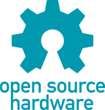
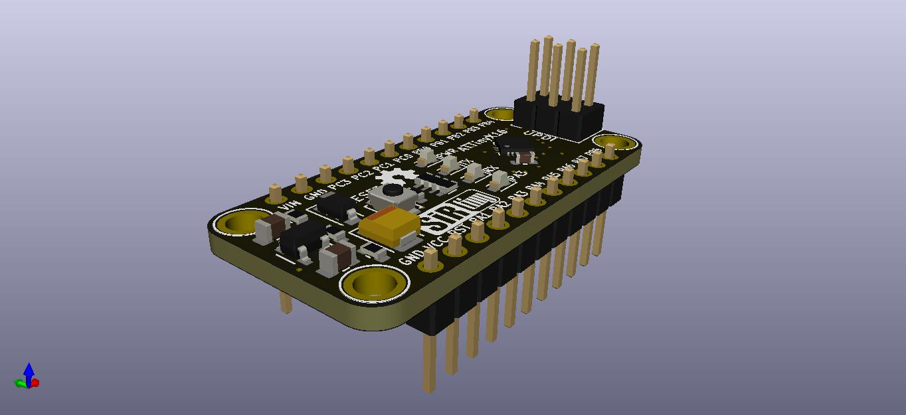

<p align="center">
  
</p>

<h1 align="center">SirBoard</h1>

<p align="center">
  <b>Open hardware for people who would rather prototype than reflow.</b><br>
  107 PCB designs — breakout adapters, development boards and a 39-part sensor line.<br>
  Routed in KiCad. Black soldermask, ENIG gold, 0.1&Prime; pitch.
</p>

<p align="center">
  <a href="https://vulos.org/projects/sirboard"><b>vulos.org/projects/sirboard</b></a>
  ·
  <a href="docs/OVERVIEW.md">Docs</a>
  ·
  <a href="LICENSE-MIT">MIT OR Apache-2.0</a>
</p>

<p align="center">
  <a href="https://www.oshwa.org/definition/">
    
  </a>
</p>

<p align="center">
  
  
</p>

---

Most interesting silicon ships in a package that will not sit on a breadboard.
SirBoard answers that in three layers: **bare adapters** you solder the part
onto yourself, **modules** with the part already placed and supported, and
**development boards** with a microcontroller, regulator, USB and headers.

## What's here

| Directory | Contents |
|---|---|
| [`Boards/Breakout/`](Boards/Breakout) | **21 adapters** — QFN, TQFP, SOIC, SOT, USB, MicroSD, coin cells, ESP module carriers |
| [`Boards/Microcontrollers/`](Boards/Microcontrollers) | ATTiny, ATMega328PB/32U4/1284P, ESP32/ESP8266 and SIMCom GNSS carriers |
| [`Boards/Interface/`](Boards/Interface) | USB-to-UART bridges, level shifters, port expanders, a USBASP programmer |
| [`Boards/Sensors/`](Boards/Sensors) | **SirBlue** — 39 digital sensors on one 4-pin JST-SH connector, plus two earlier collections (DigitalSensors 12, AnalogueSensors 2) |
| [`Boards/Modules/`](Boards/Modules) | EEPROM, FRAM, real-time clocks — 5 designs |
| [`Fritzing/`](Fritzing) | 60 hand-drawn breadboard SVGs |

## Quick start

```bash
git clone git@github.com:vul-os/sirboard.git
cd sirboard

# most designs ship a plotted PDF and renders — no tools needed to read one
open Boards/Microcontrollers/SirTiny/ATTinyX16/ATTinyX16.pdf

# or open the project itself
kicad Boards/Microcontrollers/SirTiny/ATTinyX16/ATTinyX16.pro
```

These are **KiCad 5** files (board format `20171130`). KiCad 6 through 9 open
them and offer to convert on save.

## What state is this in?

Hardware repositories rot by ambiguity, so here it is plainly.

**Can you get these made? Yes.** Every one of the 107 designs is fully routed
2-layer copper with a board outline, and plots to gerbers from source with
`kicad-cli` or File → Plot. Nothing here needs a blind via, a buried via,
controlled impedance or a non-standard stack-up, and every outline fits inside a
100 × 100 mm panel. Seven of the fine-pitch breakouts need a 5 mil process
rather than 6 mil — they are named in
[Manufacturing](docs/MANUFACTURING.md#the-5-mil-figure-is-not-decoration--quote-it-to-the-fab).

**What is *not* claimed.** No DRC or ERC report is committed for any board, and
no fabrication or bring-up log exists in this repository. The `_Front`/`_Back`/
`_Iso` images are KiCad 3D-viewer renders, not photographs of assembled boards —
so do not read them as proof that a given design was built and worked. Treat
every design as prototype-grade: **run DRC yourself and read the schematic
before you spend money on a panel.** The catalogue has shipped at least one
unconnected trace in the past (commit `28e6714`, on the TQFP48 breakout), which
is exactly the class of defect a DRC run catches and a render does not.

**Is it maintained?** The designs are stable rather than actively developed. Two
directories under `Boards/` hold a README and no design —
[`Sensors/SirRed`](Boards/Sensors/SirRed) (an analogue line on a 3-pin JST-SH)
and [`Modules/SirReference`](Boards/Modules/SirReference) (voltage references) —
and they are stated intent, not work in progress; neither is counted in the 107.
What *is* maintained is the repository's honesty:
[CI](.github/workflows/ci.yml) gates the counts, coverage tables and fab
figures in these docs against the actual `.kicad_pcb` files on every push, so a
claim here cannot quietly drift away from the copper. Fixes to existing designs
are the most welcome kind of change.

## The sensor line

Every [SirBlue](Boards/Sensors/SirBlue) board carries the same 4-pin 1.00 mm JST-SH
connector — `GND · VCC · SDA · SCL` — and the same outline. One cable fits all
39 parts, so swapping an accelerometer for a time-of-flight ranger is a
connector move rather than a rewire. A
[TCA9548A](Boards/Interface/SirExpand/TCA9548A) multiplexer handles the address
collisions when you want eight of the same part.

## We don't ship driver libraries

Every part here is a standard part with a maintained driver already in the
wild, and [`docs/LIBRARIES.md`](docs/LIBRARIES.md) names the one to install for
each — Adafruit, Pololu, SparkFun, MCUdude's cores, TinyGSM, RTClib.

SirBoard used to fork them. Those forks accumulated no functional changes and
drifted up to 384 commits behind upstream, so they were retired. A stale
driver shipped under our name is worse than no driver at all.

## Documentation

| | |
|---|---|
| [Overview](docs/OVERVIEW.md) | What SirBoard is and how the repository is laid out |
| [Getting started](docs/GETTING-STARTED.md) | Open a design, wire a sensor, install a driver |
| [Breakout adapters](docs/BREAKOUTS.md) | The 21 footprints, and how to pick one |
| [Development boards](docs/BOARDS.md) | Nine families, with the core to install for each |
| [Sensors](docs/SENSORS.md) | The full SirBlue line |
| [Modules](docs/MODULES.md) | Storage, timekeeping, reference |
| [Fritzing parts](docs/FRITZING.md) | The breadboard artwork |
| [Driver libraries](docs/LIBRARIES.md) | Part → upstream library, verified |
| [Manufacturing](docs/MANUFACTURING.md) | Stack-up, gerber export, assembly notes |

## One repository

Every product line lives in this repository, with its full history intact —
`git log -- Boards/Microcontrollers/SirTiny` returns SirTiny's own commits, and
`git blame` still names whoever drew the trace.

## Contributing

Fixes to existing designs are the most welcome kind of change — see
[CONTRIBUTING.md](CONTRIBUTING.md). Commit the KiCad sources and the renders,
never the backups or `fp-info-cache`.

## Licence

[MIT](LICENSE-MIT) OR [Apache-2.0](LICENSE-APACHE) — © VulOS. Fabricate these
designs, modify them, sell the boards. SirBoard is a Vulos project; source and
issues at [github.com/vul-os/sirboard](https://github.com/vul-os/sirboard).

---

<p align="center">
  <sub>Part of <a href="https://vulos.org">Vulos</a> — open by design.</sub>
</p>
